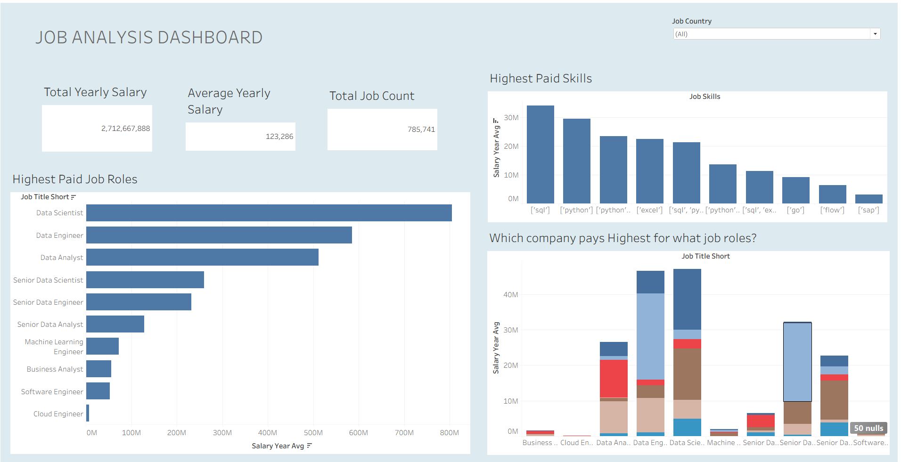

# Job Analysis Dashboards w/ Power BI & Tableau

## Introduction~

This Power BI Dashboard provides an interactive and insightful analysis of job market data, helping users understand trends in job postings, salary distribution, demand across skills, and hiring patterns.

The goal of this project is to enable data-driven decision-making for **job seekers, recruiters, and HR professionals by visualizing real-time metrics** and uncovering actionable insights from raw job data.

## Skills Demonstrated~

- Data Cleaning and Shaping using **Power Query Editor**.

- Creating calculated columns and measures using **DAX**.

- Building relationships and data models between multiple tables.

- Designing interactive **visuals, slicers, and cards**.

- Implementing **dynamic filters, conditional formatting, and data-driven insights**.

- Using Power BI themes and layout design principles for a professional dashboard.

- Also using Tableau.

## Visuals of the Dashboards~

- First Dashboard~

This Dashboard deals with the initial stages of our Job analysis, to analyze job postings by role, location, yearly and monthly salaries distributions.

This shows more drill through analysis of the page 1 with respect to a perticular job role and what skills are required for it with its salary distributions.

- More into Power Query editors and DAX funtions~
- Second Dashboard~

Diving deep into star schemas, explicit parameters, DAX functions and more ...

# Tableau

## Insights Gained for the Analysis~

- Which job roles are in highest demand.

- Which skills are most sought after by employers.

- Salary insights by role, industry, and region.

- Companies offering top salaries or frequent openings.

- Seasonal or time-based hiring patterns.
